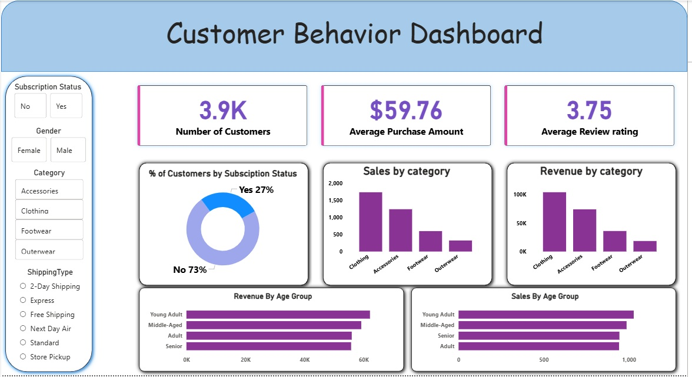

# 📊 Customer Behavior Analysis Project

🚀 End-to-End Data Analysis using Python, SQL & Power BI

---

## 🔍 Problem Statement

Businesses often struggle to understand customer purchasing behavior, the impact of discounts, and performance across product categories.

The objective of this project is to analyze customer data to uncover patterns in sales, customer segments, and product categories, enabling data-driven decision-making and improved business strategies.

---

## 🛠 Tools & Technologies Used

* Python (Pandas, NumPy, Matplotlib, Seaborn)
* SQL (MySQL)
* Power BI

---

## 📂 Project Workflow

1. Data Cleaning & Preprocessing using Python
2. Exploratory Data Analysis (EDA)
3. SQL-based Data Analysis
4. Interactive Dashboard Creation in Power BI

---

## 📊 Dashboard Preview

The following dashboard provides insights into customer behavior, sales trends, and category performance.

📁 `images/dashboard.jpg`



---

## 📈 Key Insights

* 📌 Approximately **73% customers are non-subscribers**, indicating growth opportunity in subscriptions
* 📌 **Clothing category generates highest sales and revenue**
* 📌 Discounts play a **major role in customer purchasing decisions**
* 📌 Young adults and middle-aged customers contribute most to revenue
* 📌 Average purchase amount is around **$59.76**

---

## 💡 Business Impact

* Helps businesses identify high-performing product categories
* Supports data-driven decision-making for discounts and pricing
* Enables better customer targeting and segmentation

---

## 📁 Project Structure

```
customer-behavior-analysis/
│
├── data/              # Dataset used for analysis
├── notebooks/         # Jupyter Notebook (Python analysis)
├── sql/               # SQL queries
├── powerbi/           # Power BI dashboard file (.pbix)
├── reports/           # Report & Presentation
├── images/            # Dashboard images
└── README.md
```

---

## 🚀 Conclusion

This project demonstrates how data analysis can be used to extract meaningful insights from raw data.

By combining Python, SQL, and Power BI, the analysis provides a complete understanding of customer behavior and supports strategic business decisions.

---

## 💼 Author

**Mohd Farhan**
Aspiring Data Analyst

---

## ⭐ If you like this project

Give it a ⭐ on GitHub and feel free to connect!
